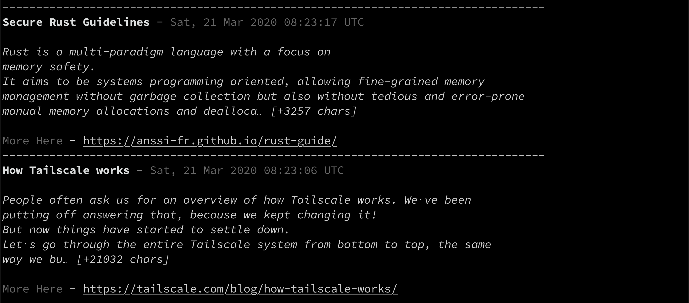

 
# HNews 

Fetch top HackerNews items on a light weight CLI. 

Powered by [newsapi] (https://newsapi.org), get your api key set it in your environment variables and you are good to go.

    NAME:
       HackerNews CLI - Get your news on the terminal
    
    USAGE:
       HNews [global options] command [command options] [arguments...]
    
    COMMANDS:
       help, h  Shows a list of commands or help for one command
    
    GLOBAL OPTIONS:
       --number_of_news value  Number of news items to be fetched (default: 10)
       --help, -h              show help

Example 

    HNews --number_of_news 10
    

Built on Golang

